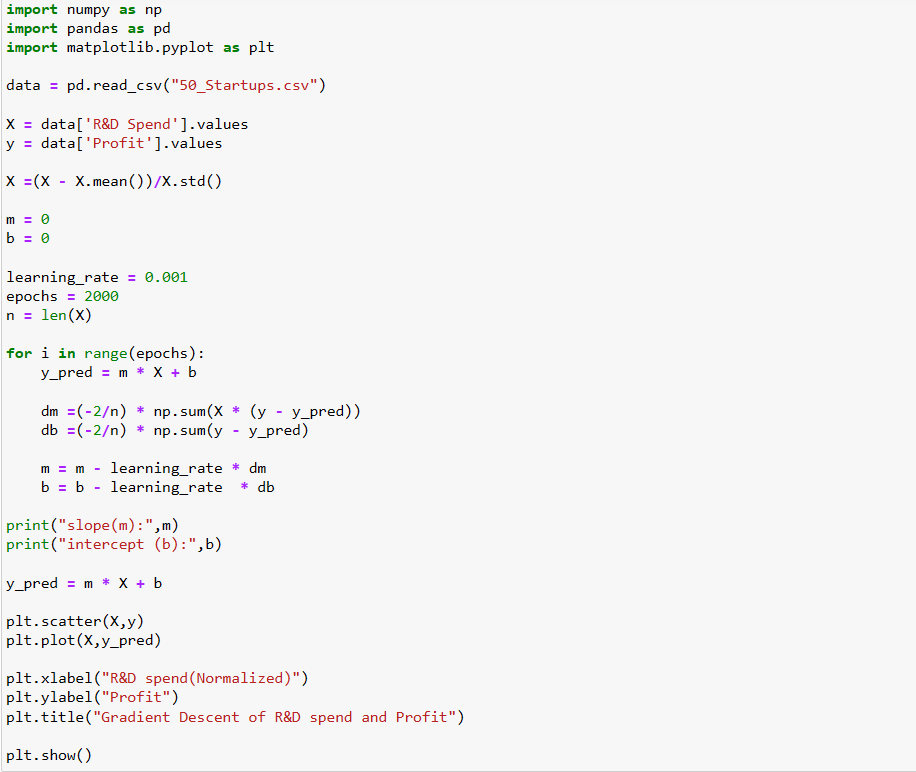
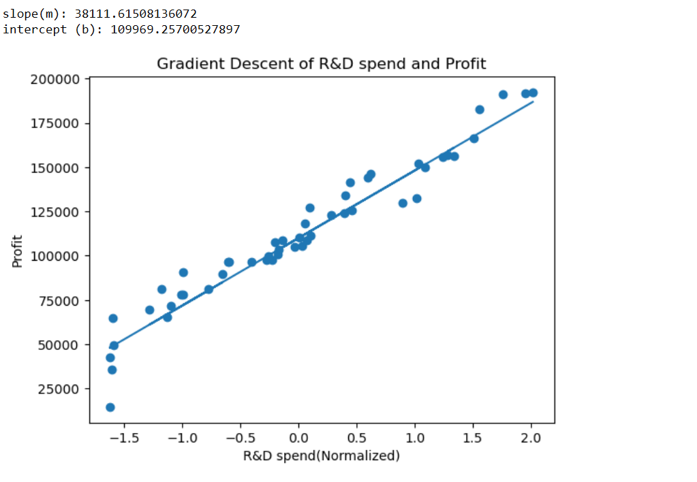

# Implementation-of-Linear-Regression-Using-Gradient-Descent

## AIM:
To write a program to predict the profit of a city using the linear regression model with gradient descent.

## Equipments Required:
1. Hardware – PCs
2. Anaconda – Python 3.7 Installation / Jupyter notebook

## Algorithm

1: Load and Normalize DataX = (X - mean(X)) / std(X)

2: Initialize Parametersm = 0b = 0learning_rate = αepochs = Nn = number of samples

3: Predict Outputy_pred = m * X + b

4: Compute Gradientsdm = (-2/n) * Σ [ X * (y - y_pred) ]db = (-2/n) * Σ [ (y - y_pred) ]

5: Update Parameters (repeat for each epoch)m = m - α * dmb = b - α * db

## Program:
```
/*
Program to implement the linear regression using gradient descent.

import numpy as np
import pandas as pd 
import matplotlib.pyplot as plt

data = pd.read_csv("50_Startups.csv")

X = data['R&D Spend'].values
y = data['Profit'].values

X =(X - X.mean())/X.std()

m = 0 
b = 0

learning_rate = 0.001
epochs = 2000
n = len(X)

for i in range(epochs):
    y_pred = m * X + b
    
    dm =(-2/n) * np.sum(X * (y - y_pred))
    db =(-2/n) * np.sum(y - y_pred)
    
    m = m - learning_rate * dm
    b = b - learning_rate  * db
    
print("slope(m):",m)
print("intercept (b):",b)

y_pred = m * X + b

plt.scatter(X,y)
plt.plot(X,y_pred)

plt.xlabel("R&D spend(Normalized)")
plt.ylabel("Profit")
plt.title("Gradient Descent of R&D spend and Profit")

plt.show()

Developed by: Swathi P N
RegisterNumber:  212225230279
*/
```

## Output:





## Result:
Thus the program to implement the linear regression using gradient descent is written and verified using python programming.
